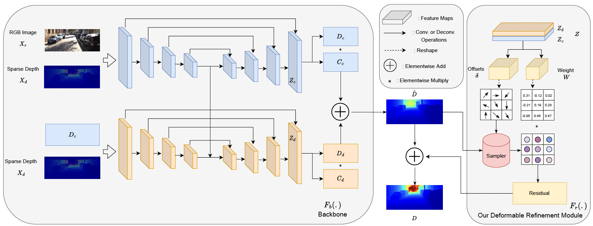
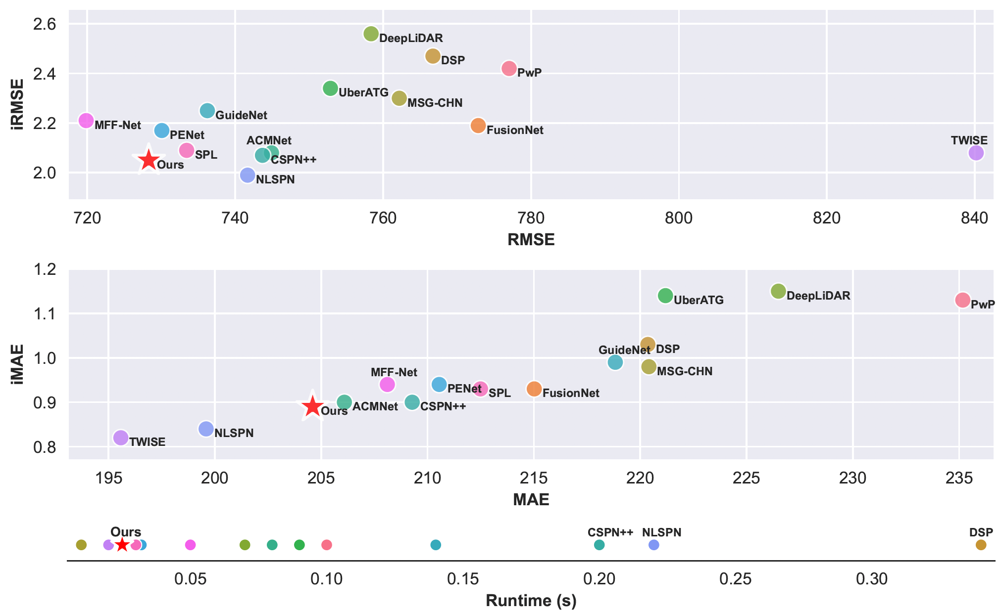

# Revisiting-Deformable-Convolution-for-Depth-Completion

This repository is for ReDC method introduced in the following paper accepted by IROS2023:

Revisiting Deformable Convolution for Depth Completion\
Xinglong Sun, Jean Ponce, Yu-Xiong Wang

## Introduction
Depth completion, which aims to generate highquality
dense depth maps from sparse depth maps, has attracted
increasing attention these years. Previous popular methods
usually employ RGB images as guidance, and introduce iterative
spatial propagation to refine estimated coarse depth
maps. However, most of the propagation refinement methods
require several iterations and suffer from a fixed receptive field,
which may contain irrelevant and useless information with very
sparse input. In this paper, we address these two challenges
simultaneously by revisiting the idea of deformable convolution.
We propose an effective architecture that leverages deformable
kernel convolution as a single-pass refinement module, and
empirically demonstrate its superiority. To better understand
the function of deformable convolution and exploit it for depth
completion, we further systematically investigate a variety of
representative strategies. Our study reveals that, different from
prior work, deformable convolution needs to be applied on an
estimated depth map with a relatively high density for better
performance. We evaluate our model on the large-scale KITTI
dataset and achieve the new state-of-the-art in terms of both
accuracy and inference speed. Our code will be publicly released
upon acceptance.

<div align="center">
  
  Overview of our method.
</div>

## Results on KITTI
<div align="center">
  
  KITTI Depth Completion Results.
</div>
Link to our public results on KITTI test server:

https://www.cvlibs.net/datasets/kitti/eval_depth_detail.php?benchmark=depth_completion&result=c00c3b4d967f78cb9e1522ebd062f763b7668f7d

## Prerequisites
### Datasets
Please follow the KITTI depth completion dataset downloading instruction here:

https://www.cvlibs.net/datasets/kitti/eval_depth.php?benchmark=depth_completion

## Train Baseline
To train the baseline/unpruned network, run:
```
python3 launch_training.py --dataset [DATASET] --method baseline --dest [DEST]
```
Example:
```
python3 launch_training.py --dataset nyuv2 --method baseline --dest "/data/"
```

### Pretrained Models
Pretrained sparsified models can be downloaded here: https://drive.google.com/drive/folders/1wHKdjXkiOQjiKJGkXdUlvBe2oOQzFkJY?usp=sharing


## Acknowledgement
Some dataloading and evaluation code is from:
https://github.com/JUGGHM/PENet_ICRA2021

Our backbone network is also taken from PENet.
## Citations
If you find this repo useful to your project or research, please cite our paper below:

@inproceedings{sun2023revisiting,\
  title={Revisiting deformable convolution for depth completion},\
  author={Sun, X and Ponce, J and Wang, Y-X},\
  booktitle={IEEE/RSJ International Conference on Intelligent Robots and Systems},\
  year={2023}\
}